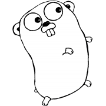
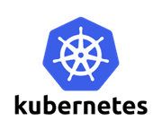

# Go plugins in 1.8



## What is a Go Plugin

### The Plugin (Shared Object)

A Go plugin is essentially a shared object. We recognize these from our close neighbors: the `C` and `C++` programming languages.

Go plugin's are *NOT* part of the original program. They are standalone binaries that adhere to an ABI (Application Binary Interface) that another Go program can choose to attempt to run.

#### The Program

A Go program can choose to implement a Go plugin (remember this is a shared object or `.so` file) at *runtime*. This is huge because we no loner have to recompile anything to drastically change the
behavior of a Go program.

## Demo

### Attach to the Official `golang:1.8` Docker Container

```bash
make
```

Which is essentially a wrapper for

```bash
docker run \
    -i \
    -t \
    -v $GOPATH/src/github.com/kris-nova/go-plugin-demo:/go/src/github.com/kris-nova/go-plugin-demo \
    -w /go/src/github.com/kris-nova/go-plugin-demo \
    --rm
```

### Compile all the things

From the docker container we can go ahead and natively compile the main program, as well as all the plugins.

```bash
make build
```

### Run the Program

By default we will be running `plugin1`. Run the program with

```bash
make run
```

### Change the Plugin at Runtime

```bash
export PLUGIN_NUMBER=2
make run
```

## Inspecting Our Plugins

### How They're Parsed

Let's look at the Go source code [here](https://github.com/golang/go/tree/release-branch.go1.8/src/plugin). The standard library has a `Cgo` implementation!

```C
#cgo linux LDFLAGS: -ldl
#include <dlfcn.h>
#include <limits.h>
#include <stdlib.h>
#include <stdint.h>
```

This includes the `dlfcn.h` file, and uses the traditional Linux linking functions. As in this prototype:

```C

#include <stdlib.h>
#include <stdio.h>
#include <dlfcn.h>

int main(int argc, char **argv) {
    void *handle;
    void (*run)();
    char *error;

    handle = dlopen ("../plugins/plugin1.so", RTLD_LAZY);
    if (!handle) {
        fputs (dlerror(), stderr);
        printf("\n");
        exit(1);
    }

    run = dlsym(handle, "plugin/unnamed-4dc81edc69e27be0c67b8f6c72a541e65358fd88.init");
    if ((error = dlerror()) != NULL)  {
        fputs(error, stderr);
        printf("\n");
        exit(1);
    }

    (*run)();
    dlclose(handle);
}
```

This gives us a hint into how Go plugins work, and explains why they are only supported in Linux right now. They use POSIX dynamic loading [more information](https://en.wikipedia.org/wiki/Dynamic_loading).

Right now there is only support for handling the linux version in the C implementation. The good news is that there is already resources for building shared objects for Windows and other archtypes.

## Using Plugins in Kubernetes Kops



See the original plugin library proposal [here](https://github.com/kubernetes/kops/issues/958).. We are now thinking about implementing a *bring your own Go plugin* model to `kops`!

### Concerns

- We will need to standardize all symbols for our plugin library.
  - We are experimenting with self-validation. This would require users to implement a well known interface, and have some sort of magic to validate their plugin can be asserted.
- Another graph walker to dynamically load plugins at runtime.
  - We would be building in a lot of boilerplate for users to have a flexible plugin model.
  - We *could* use a `*.so` model... and use the filename as the plugin unique ID.
- Support and repeatability
  - One of the big features of Go is the fact that everything ships in one nice and neet statically linked binary.
  - We now start running into permutation problems with trying to support our tool (i.e., which version of kops and with which version of a plugin).
